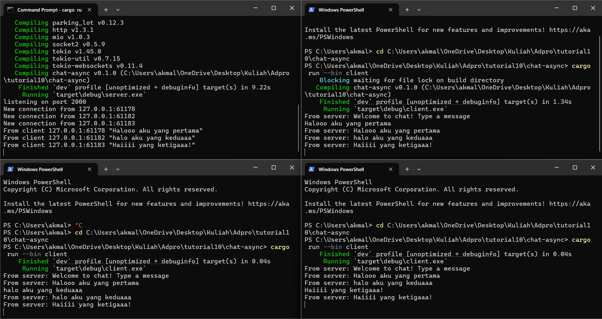

## AdvProg - Tutorial Module 10
<h2>
Nama   : Muhammad Akmal Abdul Halim

Kelas  : B

NPM    : 2306245125
</h2>

## Experiment 2.1: Original code, and how it run

Di tahap ini saya menjalankan satu server dan tiga klien untuk chat via WebSocket. Server mendengarkan di port 2000, dan tiap klien berhasil terhubung serta mengirim pesan. Begitu satu klien mengirim, pesan langsung disiarkan ke semua klien lain—menunjukkan bahwa mekanisme broadcast berfungsi sempurna. Komunikasinya bersifat asinkron, sehingga setiap klien bisa kirim dan terima pesan secara real-time tanpa saling blocking. Hasil eksperimen ini membuktikan bahwa dengan tokio_websockets dan channel broadcast dari Tokio, kita dapat dengan mudah membuat aplikasi chat sederhana yang real-time.