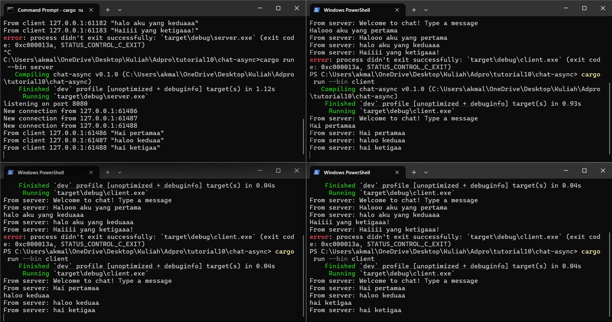
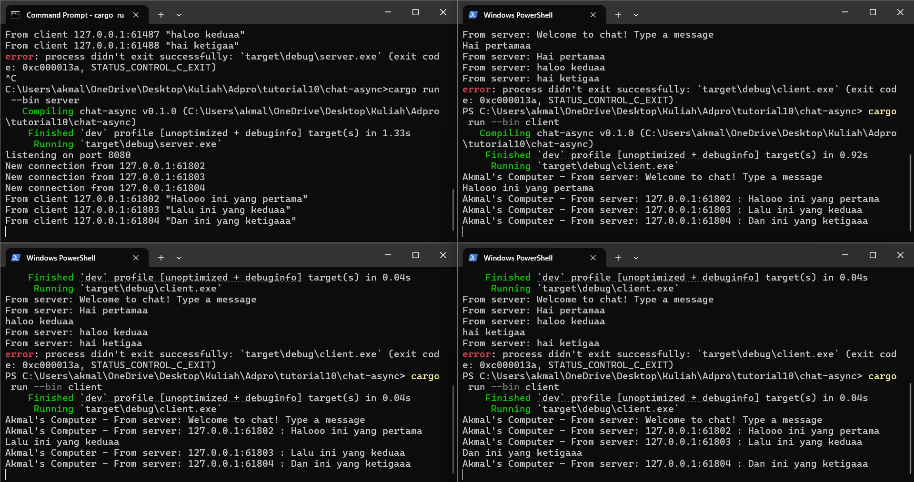

## AdvProg - Tutorial Module 10
<h2>
Nama   : Muhammad Akmal Abdul Halim

Kelas  : B

NPM    : 2306245125
</h2>

## Experiment 2.1: Original code, and how it run

Di tahap ini saya menjalankan satu server dan tiga klien untuk chat via WebSocket. Server mendengarkan di port 2000, dan tiap klien berhasil terhubung serta mengirim pesan. Begitu satu klien mengirim, pesan langsung disiarkan ke semua klien lain—menunjukkan bahwa mekanisme broadcast berfungsi sempurna. Komunikasinya bersifat asinkron, sehingga setiap klien bisa kirim dan terima pesan secara real-time tanpa saling blocking. Hasil eksperimen ini membuktikan bahwa dengan tokio_websockets dan channel broadcast dari Tokio, kita dapat dengan mudah membuat aplikasi chat sederhana yang real-time.

## Experiment 2.2: Modifying port

Pada langkah ini kita mengganti port koneksi WebSocket dari 2000 menjadi 8080 di kedua sisi—pada `TcpListener::bind` di server dan `ClientBuilder::from_uri` di klien. Setelah port disesuaikan, program tetap berjalan lancar dan klien-klien masih saling bertukar pesan secara real-time. Ini membuktikan bahwa port hanya berfungsi sebagai titik akhir komunikasi; selama server dan klien menggunakan alamat dan protokol yang sama, koneksi akan berhasil. Mekanisme WebSocket tidak berubah, begitu pula logika pengiriman pesannya, karena semua dijalankan di lapisan aplikasi.

## Experiment 2.3: Small changes, add IP and Port

Dalam eksperimen ini, saya menyertakan informasi alamat IP dan port pengirim ke setiap pesan yang diterima oleh klien. Perubahan dilakukan di sisi server, dengan menyesuaikan panggilan `bcast_tx.send(...)` sehingga menyisipkan data `addr`—alamat dan port klien pengirim. Dengan demikian, setiap klien yang menerima pesan bisa mengetahui asalnya meski belum ada identitas atau username. Di pihak klien, output juga diperjelas dengan menambahkan prefix “Akmal's Computer - From server:” untuk membedakan pesan dari server dengan masukan sendiri. Eksperimen ini memperlihatkan bagaimana data alamat socket bisa dipakai untuk memberi konteks tambahan dalam komunikasi sederhana.
